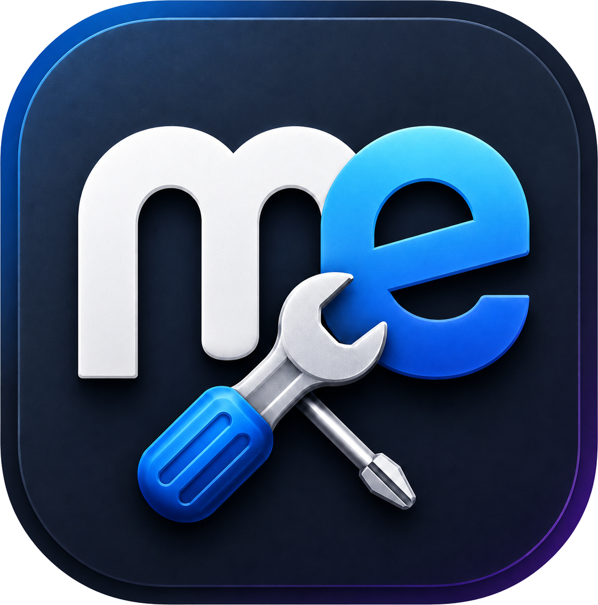
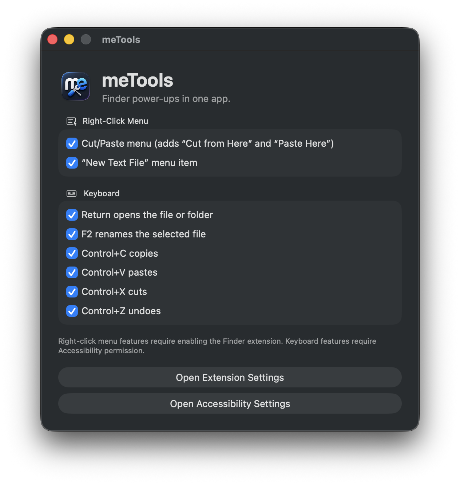
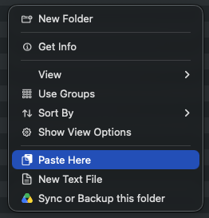
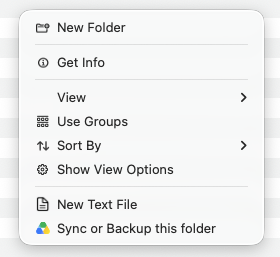

<p align="center">
  
</p>

# meTools

🇹🇷 [Türkçe açıklama için tıklayın](#metools-türkçe)

**Finder power-ups in one app — cut/paste from the right-click menu, new text files, and the keyboard shortcuts you expect.**

meTools combines three small Finder utilities (miCutPaste, miRightClick, miEnter) into a single menu-bar app and adds more. Every feature is a checkbox — turn on only what you want.

<p align="center">
  
</p>

## Features

### Right-click menu (Finder extension)

- ✂️ **Cut from Here** — right-click any file or folder (multiple selection supported) and mark it to be moved.
- 📋 **Paste Here** — right-click the empty area of the destination folder, *or right-click directly on a folder without entering it*, and the items are moved there.
- 📄 **New Text File** — right-click the empty background of any folder to create an empty `untitled.txt` right there.

| Cut a file | Paste into the current folder |
|:---:|:---:|
|  |  |

| Paste onto a folder — without entering it | New Text File |
|:---:|:---:|
|  |  |

### Keyboard (works while Finder is frontmost)

| Key | Action |
|---|---|
| `Return` | Opens the selected file or folder (instead of renaming) |
| `F2` | Renames the selected file — Windows style |
| `Control+C` | Copies the selection |
| `Control+X` | Cuts the selection (the next paste moves it) |
| `Control+V` | Pastes — moves the files if they were cut |
| `Control+Z` | Undoes the last file operation |

### And

- Lives in the menu bar — no Dock icon; the settings window opens from the menu-bar item
- Optional launch at login
- Name collisions are resolved automatically (`file 2.txt`, `file 3.txt`, …)
- Refuses to move a folder into itself or its own subfolders
- Menu icons adapt to light/dark mode
- Localized into **33 languages** — follows your system language

## Requirements

- macOS 13 Ventura or later

## Installation

### Homebrew

```bash
brew install --cask metin-aksu/tap/metools
```

Since the app is not notarized, macOS may warn you on first launch — see [the warning section](#cannot-verify-the-developer-warning) below.

If Homebrew refuses to load the tap because tap trust is required on your setup (`HOMEBREW_REQUIRE_TAP_TRUST` is set), trust it first:

```bash
brew trust --tap metin-aksu/tap
```

### Manual

1. Download the latest `.dmg` from [Releases](https://github.com/metin-aksu/meTools/releases).
2. Drag **meTools.app** into **Applications** and launch it once.

### After installing

- **Right-click menu features:** enable the Finder extension under **System Settings → General → Login Items & Extensions → Finder** (the app's *Open Extension Settings* button takes you there). The extension is loaded by Finder itself and survives reboots.
- **Keyboard features:** grant Accessibility permission under **System Settings → Privacy & Security → Accessibility** (the app prompts on first launch). Keyboard features need the app running — enable **Launch at Login** from the menu-bar item so they are always available.

### "Cannot verify the developer" warning

The app is code-signed but not notarized by Apple, so on first launch macOS may show a warning such as *"meTools cannot be opened because Apple cannot check it for malicious software."* To clear it, remove the quarantine flag after copying the app into Applications:

```bash
xattr -dr com.apple.quarantine /Applications/meTools.app
```

Then launch the app normally. Alternatively: right-click the app → **Open** → **Open**, or allow it under **System Settings → Privacy & Security**.

## Known limitation: iCloud-managed folders

If **iCloud Drive → "Desktop & Documents Folders"** syncing is enabled, Finder treats `~/Desktop` and `~/Documents` as iCloud locations, where macOS does not run Finder Sync extensions. The right-click menu items will not appear there. This is an Apple platform restriction that affects all Finder Sync extensions; the keyboard features are unaffected.

## Building from source

The Xcode project is generated with [XcodeGen](https://github.com/yonaskolb/XcodeGen):

```bash
brew install xcodegen
xcodegen generate
xcodebuild -project meTools.xcodeproj -scheme meTools -configuration Release build
```

Code signing uses the `Developer ID Application` identity configured in [project.yml](project.yml) — point `DEVELOPMENT_TEAM` at your own team to build locally.

### Project layout

```
project.yml           XcodeGen project definition
App/                  Menu-bar app: settings window, status item, event tap
  <lang>.lproj/       Localizations (33 languages)
FinderExtension/      Finder Sync extension (cut/paste + new text file)
  <lang>.lproj/       Localizations (33 languages)
Shared/               Settings keys shared between app and extension
scripts/uninstall.sh  Removes every trace of meTools (and the old apps)
logo.png              App icon source image
```

### How it works

- The right-click items come from a [Finder Sync](https://developer.apple.com/documentation/findersync) app extension. "Cut" stores the selected paths; "Paste" moves them with `FileManager.moveItem`. The extension is sandboxed (required for Finder Sync) with a file-access exception entitlement.
- The keyboard features use a `CGEvent` tap that is active only while Finder is frontmost. It remaps `Return` to Finder's Open command (`⌘↓`), `F2` to inline rename, and `Control+C/X/V/Z` to their `⌘` equivalents (`Control+V` becomes `⌘⌥V` after a cut, so the files are moved). Text fields keep their normal behavior.
- Feature toggles are shared with the extension through an app-group defaults suite, so changes apply instantly — no restarts.

## License

MIT © Metin Aksu

---

# meTools (Türkçe)

**Finder güçlendirmeleri tek uygulamada — sağ tık menüsünden kes/yapıştır, yeni metin dosyası ve alışkın olduğunuz klavye kısayolları.**

meTools, üç küçük Finder aracını (miCutPaste, miRightClick, miEnter) tek bir menü çubuğu uygulamasında birleştirir ve üzerine yenilerini ekler. Her özellik bir onay kutusudur — yalnızca istediğinizi açın.

## Özellikler

### Sağ tık menüsü (Finder eklentisi)

- ✂️ **Buradan Kes** — herhangi bir dosyaya veya klasöre sağ tıklayın (çoklu seçim desteklenir) ve taşınmak üzere işaretleyin.
- 📋 **Buraya Yapıştır** — hedef klasörde boş alana sağ tıklayın *veya klasöre girmeden doğrudan üzerine sağ tıklayın*; öğeler oraya taşınır.
- 📄 **Yeni Metin Dosyası** — herhangi bir klasörün boş zeminine sağ tıklayarak orada boş bir `untitled.txt` oluşturun.

| Dosya kesme | Bulunulan klasöre yapıştırma |
|:---:|:---:|
|  |  |

| Klasöre girmeden üzerine yapıştırma | Yeni Metin Dosyası |
|:---:|:---:|
|  |  |

### Klavye (Finder öndeyken çalışır)

| Tuş | Eylem |
|---|---|
| `Return` | Seçili dosyayı veya klasörü açar (yeniden adlandırma yerine) |
| `F2` | Seçili dosyanın adını değiştirir — Windows tarzı |
| `Control+C` | Seçimi kopyalar |
| `Control+X` | Seçimi keser (sonraki yapıştırma taşır) |
| `Control+V` | Yapıştırır — kesilmişse dosyaları taşır |
| `Control+Z` | Son dosya işlemini geri alır |

### Ayrıca

- Menü çubuğunda yaşar — Dock ikonu yoktur; ayar penceresi menü çubuğu simgesinden açılır
- İsteğe bağlı oturum açılışında başlatma
- İsim çakışmaları otomatik çözülür (`dosya 2.txt`, `dosya 3.txt`, …)
- Bir klasörü kendi içine veya alt klasörüne taşımayı reddeder
- Menü ikonları açık/koyu moda uyum sağlar
- **33 dile** çevrildi — sistem dilinizi izler

## Gereksinimler

- macOS 13 Ventura veya üzeri

## Kurulum

### Homebrew

```bash
brew install --cask metin-aksu/tap/metools
```

Uygulama notarize edilmediği için macOS ilk açılışta uyarı gösterebilir — aşağıdaki [uyarı bölümüne](#geliştirici-doğrulanamıyor-uyarısı) bakın.

Kurulumunuzda tap güveni zorunluysa (`HOMEBREW_REQUIRE_TAP_TRUST` ayarlıysa) ve Homebrew tap'i yüklemeyi reddederse, önce tap'i güvenilir olarak işaretleyin:

```bash
brew trust --tap metin-aksu/tap
```

### Elle kurulum

1. [Releases](https://github.com/metin-aksu/meTools/releases) sayfasından en son `.dmg` dosyasını indirin.
2. **meTools.app**'i **Applications** klasörüne sürükleyin ve bir kez çalıştırın.

### Kurulumdan sonra

- **Sağ tık menüsü özellikleri:** Finder eklentisini **Sistem Ayarları → Genel → Oturum Açma Öğeleri ve Uzantılar → Finder** bölümünden etkinleştirin (uygulamadaki *Eklenti Ayarlarını Aç* düğmesi sizi oraya götürür). Eklentiyi Finder'ın kendisi yükler ve yeniden başlatmalardan etkilenmez.
- **Klavye özellikleri:** **Sistem Ayarları → Gizlilik ve Güvenlik → Erişilebilirlik** bölümünden izin verin (uygulama ilk açılışta izin ister). Klavye özellikleri için uygulamanın çalışıyor olması gerekir — menü çubuğu simgesinden **Oturum Açıldığında Başlat** seçeneğini işaretlerseniz her zaman hazır olur.

### "Geliştirici doğrulanamıyor" uyarısı

Uygulama kod imzalıdır ancak Apple tarafından notarize edilmemiştir; bu yüzden ilk açılışta macOS *"meTools açılamıyor çünkü Apple onu kötü amaçlı yazılım açısından denetleyemiyor."* benzeri bir uyarı gösterebilir. Uyarıyı kaldırmak için uygulamayı Applications klasörüne kopyaladıktan sonra karantina işaretini silin:

```bash
xattr -dr com.apple.quarantine /Applications/meTools.app
```

Ardından uygulamayı normal şekilde açın. Alternatif olarak: uygulamaya sağ tıklayıp **Aç** → **Aç** deyin veya **Sistem Ayarları → Gizlilik ve Güvenlik** bölümünden izin verin.

## Bilinen kısıt: iCloud tarafından yönetilen klasörler

**iCloud Drive → "Masaüstü ve Belgeler Klasörleri"** eşitlemesi açıksa Finder, `~/Desktop` ve `~/Documents` klasörlerini iCloud konumu olarak ele alır ve macOS bu konumlarda Finder Sync eklentilerini çalıştırmaz; sağ tık menü öğeleri orada görünmez. Bu, tüm Finder Sync eklentilerini etkileyen bir Apple platform kısıtıdır; klavye özellikleri bundan etkilenmez.

## Kaynaktan derleme

Xcode projesi [XcodeGen](https://github.com/yonaskolb/XcodeGen) ile üretilir:

```bash
brew install xcodegen
xcodegen generate
xcodebuild -project meTools.xcodeproj -scheme meTools -configuration Release build
```

Kod imzalama, [project.yml](project.yml) içinde yapılandırılan `Developer ID Application` kimliğini kullanır — yerelde derlemek için `DEVELOPMENT_TEAM` değerini kendi takımınıza yönlendirin.

## Lisans

MIT © Metin Aksu
